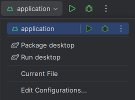

# NeoRegex

A cross-platform app to validate regular expressions.

## Platforms

| Platform | Status |
|----------|--------|
| Android  | ✅      |
| Windows  | ✅      |
| Linux    | ✅      |

## Build

To build this project, the JDK (Java Development Kit) and the Android SDK are required.
I recommend using [Intellij IDEA](https://www.jetbrains.com/idea/download) as the IDE, with the **Android**, **Jetpack
Compose** and **Compose Multiplatform** plugins installed.

> You can get the **JDK** and **Android SDK** directly from **Intellij IDEA**.

Use run configurations to get started.  

## License

This project is licensed under [GPLv3](https://www.gnu.org/licenses/gpl-3.0.html), a copyleft free software license. You are permitted to copy, modify, and
redistribute the code, provided that the redistribution is accompanied by the corresponding source code under the same
license, in order to maintain its free software nature. 

You can find a copy of the license in the [LICENSE](/LICENSE)
file of this project or access the original version at https://www.gnu.org/licenses/gpl-3.0.html.
