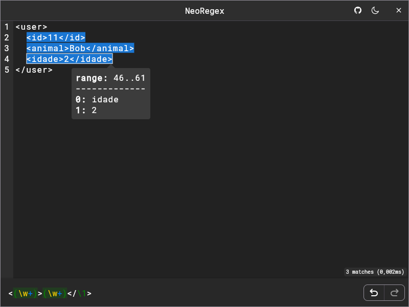

  

<h1 align="center">NeoRegex</h1>

A cross-platform app to validate regular expressions.

    

    
    

    You can also download the installer for your platform from the <a href="https://github.com/NeoUtils/NeoRegex/releases">releases</a>, or test it directly on the <a href="https://neoregex.neoutils.com/">web</a>.

## Platforms

| Platform | Status |
|----------|--------|
| Android  | ✅      |
| iOS      | ❌      |
| Windows  | ✅      |
| Linux    | ✅      |
| macOS    | ✅      |
| Web      | ✅      |

## Build

To build this project, the JDK 17 and the Android SDK are required.
I recommend using [Intellij IDEA](https://www.jetbrains.com/idea/download) as the IDE, with the **Android**, **Jetpack Compose** and **Compose Multiplatform** plugins installed.

> [!TIP]
> - You can obtain the **JDK** and **Android SDK** directly from **IntelliJ IDEA**.
> - Use **JBR** (JetBrains Runtime) for better window integration.
> - Use run configurations to get started.

## Acknowledgments

NeoRegex utilizes several open-source libraries that greatly enhance its functionality. We would like to thank the authors and contributors of the following projects for their amazing work:

- [**Highlight**](https://github.com/NeoUtils/Highlight):  This library provides essential syntax highlighting features, making the pattern more readable and visually appealing.
- [**multiplatform-settings**](https://github.com/russhwolf/multiplatform-settings): A useful library for managing settings across multiple platforms, allowing us to easily persist user preferences.
- [**dbus-java**](https://github.com/hypfvieh/dbus-java): This library enables integration with D-Bus, providing important desktop interprocess communication capabilities for Linux systems.

## License

This project is licensed under [GPLv3](https://www.gnu.org/licenses/gpl-3.0.html), a copyleft free software license. You
are permitted to copy, modify, and
redistribute the code, provided that the redistribution is accompanied by the corresponding source code under the same
license, in order to maintain its free software nature.

You can find a copy of the license in the [LICENSE](/LICENSE)
file of this project or access the original version at https://www.gnu.org/licenses/gpl-3.0.html.

